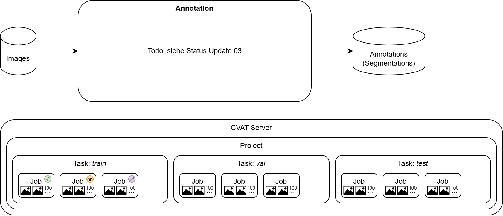

# Traffic Sign Recognition
Work-in-Progress, Traffic Sign Recognition for the city of Rostock.

In images taken during 360° "street view" rides, traffic signs should be detected and classified in order to later compare detections with the city's cadastre of traffic signs. 

## Overview


1. Own images are preprocessed to filter out irrelevant images and restructure the remaining images.
2. Remaining images are labeled using the annotation tool "CVAT" (manually drawing frames around traffic signs), the annotations are saved in [YOLOv8 Segmentation](https://yolov8.org/yolov8-annotation-format/) format.
3. Annotations need to be prepared for training by adjusting the paths in the annotation files.
4. Annotations are used for fine-tuning a pre-trained model – enabling an existing model that can distinguish everyday objects to specifically classify traffic signs.
5. The resulting model is then used during inference (application) to automatically draw frames around traffic signs in new images.

## 1) Image Preprocessing
Filter & Restructure source images using the `preprocessing/restructure_source_images.py` script.

### Running the preprocessing script
1. Download the source images to a local folder.
2. Edit the `preprocessing/restructure_source_images.py` script to point to the source images folder.
3. Run the script: `python preprocessing/restructure_source_images.py`

## 2) Annotation
Using the Computer Vision Annotation Tool (CVAT).



See the list of all traffic sign classes here: [annotation/all_traffic_signs/Readme.md](annotation/all_traffic_signs/Readme.md)

### Installing the CVAT Server
Assuming a linux environment with [docker](https://docs.docker.com/engine/install/ubuntu/) and [docker compose](https://docs.docker.com/compose/install/) installed.

1. Run the installation script `annotation/install.sh`, it will download cvat to `annotation/cvat` and ask you to create an admin user.

### Starting the CVAT Server
1. Run the start script `annotation/start.sh`
2. Open the URL `http://localhost:8080` in your web-browser to open CVAT

### Annotation Process
1. Inside the CVAT web interface create a new project using the labels from `annotation/labels.tsr_example.json`.
   (In the future, we will have the finale labels in such a file, but for now, we use this example.)
2. Open the newly created project and create a new task, select a subset
   (type one of train/test/val manually, do not select the existing ones with slightly different writing), 
   upload some of the image files there (adhere to the annotation guidelines).
3. Select the newly created job to start annotating  (adhere to the annotation guidelines).
4. Once all annotations are finished, export the annotations via "Project -> Export Dataset" in _YOLOv8 Segmentation 1.0_ format.
5. Additionally, you may backup the project via "Project -> Backup".

### Stopping the CVAT Server
1. Run the stop script `annotation/stop.sh`

### Later: Iterative Annotation
Pre-selecting Traffic Signs in the annotation task based from previous labeling iterations will be implemented in the future.


## 3) Preparing the Dataset

The export from CVAT should be unzipped and copied into a subfolder in the datasets folder, e.g. to a subfolder named `tsr`.

Once the dataset is copied there, some paths inside the txt and yaml files of the export need to be adjusted.
For this, please run the `datasets/fix_path.sh` script like this, where `tsr` is the name of the subfolder you created for your dataset:

```bash
datasets/fix_path.sh tsr
```

### Viewing dataset statistics
To view the statistics of the dataset, run the `datasets/stats.py` script like this, where `tsr` is the name of the subfolder you created for your dataset:

```bash
python datasets/stats.py tsr
```

## 4) AI Recognition Environment
Using YOLO.

`/Attention !\` At the moment training is not optimized in any way yet, but you can test if it works at all.

### Installing 
- Run `recognition/install.sh` to set up a docker container that serves as a starting point for the pre-made python scripts

### Start Training
- ``recognition/run.sh train tsr_example``

- TODO Validation

### Start Inference
- ``recognition/run.sh inference tsr_example``

- TODO Export

### Installing for development
- Run `recognition/install_dev.sh` to install the python environment locally

- TODO Visualization
