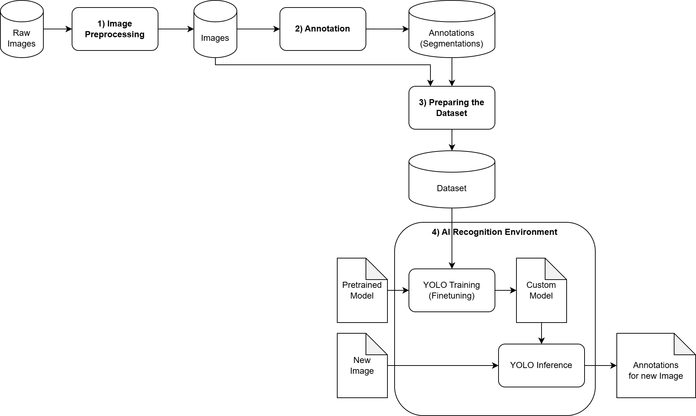

# Traffic Sign Recognition
Work-in-Progress, Traffic Sign Recognition for the city of Rostock.

In images taken during 360° "street view" rides, traffic signs should be detected and classified in order to later compare detections with the city's cadastre of traffic signs. 

## Overview

1. Own images are labeled using the annotation tool "CVAT" (manually drawing frames around traffic signs), the annotations are saved in [YOLOv8 Segmentation](https://yolov8.org/yolov8-annotation-format/) format.
2. Annotations are used for fine-tuning a pre-trained model – enabling an existing model that can distinguish everyday objects to specifically classify traffic signs.
3. The resulting model is then used during inference (application) to automatically draw frames around traffic signs in new images.

## 1) Annotation
Using the Compouter Vision Annotation Tool (CVAT).

### Installing the CVAT Server
Assuming a linux environment with [docker](https://docs.docker.com/engine/install/ubuntu/) and [docker-compose](https://docs.docker.com/compose/install/) installed.

1. Run the installation script `annotation/install.sh`, it will download cvat to `annotation/cvat` and ask you to create an admin user.

### Starting the CVAT Server
1. Run the start script `annotation/start.sh`
2. Open the URL `http://localhost:8080` in your web-browser to open CVAT

### Annotation Process
1. Inside the CVAT web interface create a new project using `annotation/labels.json`.
2. Open the newly created project and create a new task, select a subset (train/test/val), upload some of the image files there.
3. Select the newly created job to start annotating.
 
TODO: Pre-selecting Traffic Signs in the annotation task based from previous labeling iterations.

TODO Visualization

### Stopping the CVAT Server
1. Run the stop script `annotation/stop.sh`

## 2) Preparing the Dataset
Export from CVAT and copy into the datasets folder as dataset with the name `tsr`.

It should follow the same structure as `tsr_example`.

**TODO: Add tsr_example dataset**

## 3) AI Recognition Environment
### Installing 
- Run `recognition/install.sh` to set up a docker container that serves as a starting point for the pre-made python scripts

### Start Training
- ``recognition/run.sh train tsr_example``
- TODO Validation

### Start Inference
- ``recognition/run.sh inference tsr_example``
- TODO Export

### Installing for development
- Run `recognition/install_dev.sh` to install the python environment locally

TODO Visualization