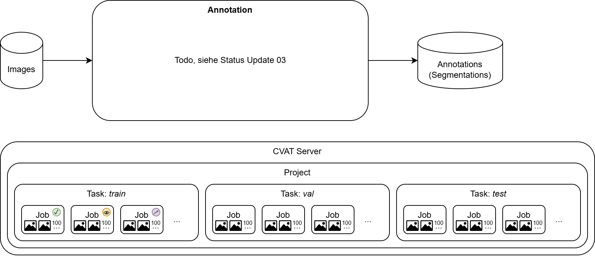

# Annotation
Using the Computer Vision Annotation Tool (CVAT).

See the list of all traffic sign classes here: [all_traffic_signs/Readme.md](all_traffic_signs/Readme.md)

## Annotation Guideline (Draft)

Defines the desired accuracy and how to handle certain situations.

1. Tasks in CVAT should be divided into different jobs, e.g., with 100 frames each
2. Jobs in CVAT should go through all three stages:
   1. *annotation* – Person A
      1. Delete images with faces & license plates   
      2. Mark traffic signs with frames
   2. *validation* – Person B
      1. Check if frames are correct, if not: mark "issues"
      2. Delete images with faces & license plates
   3. *acceptance* – Person A
      1. Go through issues and resolve them (e.g., add missing signs)
3. If a traffic sign is more than about 10% occluded, the *occluded* property should be set. 

    | Button in UI                                          | *not occluded*, "normal" wear                           | *occluded*, half the sign obscured by a tree    |
    |-------------------------------------------------------|---------------------------------------------------------|-------------------------------------------------|
    |  |  |  |

4. For partially occluded signs, the assumed complete shape is drawn, not just the visible part.
5. Signs should be marked if a human can clearly recognize them without guessing. Signs that are too small or otherwise unclear are not annotated.
    
    | *not annotated*, not clearly recognizable if there is an arrow at the bottom | *not annotated*, context suggests parking, but nothing is recognizable            | *annotated*, strongly overexposed but clearly recognizable                            | *annotated*, only half visible but clearly recognizable |
    |------------------------------------------------------------------------------|-----------------------------------------------------------------------------------|---------------------------------------------------------------------------------------|---------------------------------------------------------|
    |                                    |                   |                                                           |                             |

6. Related signs (e.g., parking sign with a white supplementary sign) are annotated separately and thus receive multiple frames
7. Signs that do not exactly match one of the labels are not annotated  
   (do not search for the "next best" matching sign).
8. Frames are drawn with the appropriate annotation tools. Round sign = ellipse, triangular = polygon (3 corners), square = rectangle, rotate shapes if necessary.
9. Only strongly skewed (distorted) signs require a polygon instead of a rectangle
10. Frames are drawn as closely as possible, without cutting off parts of the sign. Better to have a little too much in the frame than too little. 
11. Images without traffic signs are not deleted (except for data protection reasons).
12. The backs of traffic signs are not marked
13. Traffic signs in posters, on vehicles, or in reflections are not marked (not desired for our use case). 

## Update CVAT
To ensure a safe update, please ensure that:
- all important data (database, images, annotations, config files) are not stored inside the container, but on the host system (use volumes or bind mounts).
  - volumes:
    - docker volume create myvolume
    - docker run -v myvolume:/app/data myimage
    - or docker run --mount source=myvolume,target=/app/data myimage
  - bind mount:
    - docker run -v /pfad/auf/dem/host:/app/data myimage
    - or docker run --mount type=bind,source=/pfad/auf/dem/host,target=/app/data myimage
  - or via docker compose 

After this, you can check the content of `update.sh` and use the commands inside to update the container.