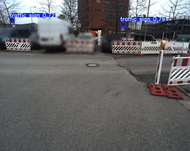

# Research
## Dataset Research
### General Datasets for Object Detection/Segmentation and Image Classification

Conveying to the AI a general understanding of objects and structures in "our world," serving as the foundation for AI training. A list of datasets already prepared for YOLO can be found [here](https://github.com/ultralytics/ultralytics/tree/main/ultralytics/cfg/datasets). For these large datasets, there are usually pre-trained models available.

|  |  |  |  |  |  |
| --- | --- | --- | --- | --- | --- |
| Dataset | # Images | # Classes | Relevant Classes | Label | License |
| [ImageNet](https://www.image-net.org/index.php) | 14,000,000 | 100,000 | Street Sign | Per image | Non Commercial |
| [COCO](https://cocodataset.org/#home) | 200,000 | 80 | Stop Sign | Instance Segmentation | Flickr Images, Labels CC-BY |
| [Open Images](https://storage.googleapis.com/openimages/web/index.html) | xx,000,000 | 600 | Traffic Sign, Stop Sign; only BBox: Street Sign | Instance Segmentation | CC-BY |
| [Objects365](https://www.objects365.org/overview.html) | 2,000,000 | 365 | Traffic Sign, Crosswalk Sign, Speed Limit Sign, Stop Sign | Bounding Box | Flickr Images, Labels CC-BY |
| [LVIS](https://www.lvisdataset.org/) large vocabulary instance segmentation | 164,000 | 1,200 | Stop Sign, Street Sign | Instance Segmentation | CC-BY |

### Datasets for Traffic Sign Recognition

For testing the prototype, as long as your own data is not yet labeled, and for testing the final model accuracy. For later productive use, pay attention to licenses!

|  |  |  |  |  |  |
| --- | --- | --- | --- | --- | --- |
| Dataset | # Images | # Classes | Image Type | Label | License |
| [GTSRB German Traffic Sign Benchm](https://benchmark.ini.rub.de/). ([Paper](https://ieeexplore.ieee.org/document/6033395)) | 50,000 | 42 | Cropped | Bounding Box | Free to use |
| [GTSDB German Traffic Sign Benchmarks](https://benchmark.ini.rub.de/gtsdb_news.html) | 900 | 42 | Dashcam | Bounding Box | Free to use |
| [BTSD Belgian Traffic Sign Dataset](https://btsd.ethz.ch/shareddata/) ([Paper](https://btsd.ethz.ch/shareddata/publications/Mathias-IJCNN-2013.pdf)) | 7,000 (+) | 62 (210) | Multicam sequences | Bounding Box | N/A |
| [LISA Traffic Sign Dataset](https://git-disl.github.io/GTDLBench/datasets/lisa_traffic_sign_dataset/) (US) | 6,610 | 47 | Various cameras | Bounding Box | "Academic" |
| [Swedish Traffic Signs Dataset](https://www.cvl.isy.liu.se/en/research/datasets/traffic-signs-dataset/) | 3,488 | 7 | Dashcam | Bounding Box | Public, must cite |
| [DFG Traffic Sign Data SeT (Slovenia)](https://www.vicos.si/resources/dfg/) | 7,000 | 200 | Dashcam | COCO Polygon Segmentation | CC-BY-NC-SA |
| [CCTSDB Chinese Traffic Sign Detection Bench.](https://github.com/csust7zhangjm/CCTSDB) ([Download 2021](https://github.com/csust7zhangjm/CCTSDB2021)) | 16,356 | 42 | Dashcam | Bounding Box | N/A |
| [TT100K Tencent Traffic-Sign Detection](https://cg.cs.tsinghua.edu.cn/traffic-sign/) | 100,000 | 127 | Street View Panorama | Pixel Mask Segmentation | CC-BY-NC |
| [Mapillary Traffic Sign Dataset](https://www.mapillary.com/dataset/trafficsign) ([Paper](https://arxiv.org/abs/1909.04422)) | 100,000 (52k) | 300 | Dashcam, Worldwide | Bounding Box | CC-BY-NC-SA |

## Annotation

### Annotation Tool: CVAT

As the annotation tool, I have chosen **[CVAT](https://github.com/cvat-ai/cvat)**, as it is free, open source, and has been established for several years. It is still being further developed and, despite its quickly understandable primary functions, is very comprehensive.

**Image source:** Screenshot self-created, image from your sample data

Annotation frames can be easily placed with the mouse via "drag & drop," and their size and number of corner points can be adjusted. Class labels can be selected via dropdown menus.

For more advanced and efficient usage, objects tracked across multiple images can also be added (optionally with AI support for object tracking / suggestions). There are numerous keyboard shortcuts for quickly processing large amounts of images, and multi-user operation with separate accounts is possible.

### Annotation Format: YOLO V8 Segmentation

For the data, I have chosen the **[YOLO V8 Segmentation](https://yolov8.org/yolov8-annotation-format/)** format. It makes it possible to store images and annotations together in a simple folder structure and is easy to understand for both computers and humans.

This format is compatible both with the intended annotation tool **CVAT** and with the planned framework **YOLO**.

Basically, for each image file, a text file with the same name is created, which contains the respective annotations. Each line of these files describes an object instance with information such as the class label, bounding box coordinates, and optionally further attributes.

In addition, there are a few files describing the dataset and the dataset splits.

### First Proof-of-Concept for Finetuning & Inference

For finetuning, a pre-trained YOLOv8 model was loaded and retrained for 100 epochs with 10 images from the self-created dataset. In this first prototype, only a single class, "Traffic Sign," appeared in this dataset, which could be distinguished from the background. A distinction within the traffic signs was not yet possible here. In a next step, it should be easily possible to annotate additional classes and take them into account during finetuning.

**Image source:** Frame drawn by own Python script, image from your sample data

Due to the small amount of data, no meaningful quality assessment is possible yet. The experiment primarily served to see how finetuning works in this framework from a code perspective.

### Concept for Naming Classes of Traffic Signs

To structure the presumably large number of traffic sign types that need to be distinguished, a concept is necessary.

I suggest extracting all relevant signs from the following list:

[**Illustration of traffic signs in the Federal Republic of Germany since 2017 (Wikipedia)**](https://de.wikipedia.org/wiki/Bildtafel_der_Verkehrszeichen_in_der_Bundesrepublik_Deutschland_seit_2017)

or from the underlying [Annexes 1–4 to §§40–43 StVO (German Road Traffic Regulations)](https://www.gesetze-im-internet.de/stvo_2013/index.html)

and naming them according to the following schema:

[Number]_[simplified description]

For example:

* 205_vorfahrt_gewaehren
* 206_halt_vorfahrt_gewaehren
* 283_10_absolutes_halteverbot_anfang_rechts
* 314_10_parken_links
* parkplatz
* 265_hoehe

Traffic sign numbers are written with underscores, and the names are also in "snake_case" with umlauts spelled out and without numbers at the beginning.

This ensures that the class names are readable for both machines and humans.

If a traffic sign does not have a number, it is omitted.

Creating this list requires expert knowledge of the StVO or the intended use case. Therefore, I would like to ask you to create this list. When creating this list, I also leave it up to you whether, for example, you want to further subdivide 274_hoechstgeschwindigkeit according to speed values into, for example, 274_hoechstgeschwindigkeit_30, 274_hoechstgeschwindigkeit_50, etc.

It should be noted that for training, a sufficient number of example images is required for each of these classes. The exact number depends on the quality of the pre-trained model, but roughly estimated, around 50+ (different) examples per sign are good; however, the more images per class, the better.

Based on a simple line-separated list of these classes, a "labels.json" file can then be generated automatically, which is needed for CVAT.

**Note:** CVAT also supports attributes such as numbers or free text for each class, which could be useful for speed limits or place signs, etc. The quality of data annotation would be enhanced by this, but due to the increased annotation effort, I have not considered this variant further for now.

### Annotation Guideline (Draft)

see [/annotation/README.md](/annotation/README.md)

### New example dataset: Example annotation according to the new concept

The images available to me have been preprocessed and manually annotated with the new concepts, the annotation guideline, and the distinction of different types of traffic signs with respect to the following classes:

Using the new stats.py script, it was determined how often each class was annotated:

| **Sign** | **train**  501 images  218 annot. | **val**  71 images  22 annot. | **test**  144 images  73 annot. |
| --- | --- | --- | --- |
| 123_arbeitsstelle | 3 | 0 | 0 |
| 205_vorfahrt_gewaehren | 19 | 3 | 6 |
| 206_halt_vorfahrt_gewaehren | 3 | 0 | 0 |
| 209_fahrtrichtung_rechts | 3 | 0 | 1 |
| 209_30_fahrtrichtung_geradeaus | 2 | 0 | 3 |
| 250_verbot_alle | 1 | 0 | 2 |
| 265_hoehe | 3 | 0 | 1 |
| 274_1_zone_30 | 0 | 0 | 0 |
| 274_hoechstgeschwindigkeit | 0 | 0 | 0 |
| 283_10_absolutes_halteverbot_anfang_rechts | 8 | 0 | 2 |
| 283_20_absolutes_halteverbot_ende_rechts | 13 | 1 | 2 |
| 283_30_absolutes_halteverbot_mitte_rechts | 3 | 0 | 1 |
| 283_absolutes_halteverbot | 51 | 6 | 11 |
| 286_10_eingeschraenktes_halteverbot_anfang_rechts | 0 | 0 | 0 |
| 286_20_eingeschraenktes_halteverbot_ende_rechts | 2 | 1 | 0 |
| 286_30_eingeschraenktes_halteverbot_mitte_rechts | 1 | 0 | 0 |
| 286_eingeschraenktes_halteverbot | 13 | 1 | 2 |
| 314_10_parken_links | 0 | 0 | 0 |
| 314_20_parken_rechts | 0 | 0 | 0 |
| 314_30_parken_mitte | 0 | 0 | 0 |
| 314_50_parkhaus | 0 | 0 | 0 |
| 325_1_verkehrsberuhigter_bereich_beginn | 1 | 0 | 0 |
| 325_2_verkehrsberuhigter_bereich_ende | 0 | 0 | 0 |
| parkplatz | 0 | 0 | 0 |

It is noticeable that for some classes (especially parking) the number is 0, although these were definitely annotated. Here, CVAT apparently does not export everything, so the total number of objects does not match expectations. This error still needs to be checked.

The next step is to test the prototype on this data.

## Training Visualization & Auto-Save
During Training, models should regularly be saved to prevent data loss. When resuming training, models should continue to be trained based on the most recent model.

To visualize training progress and ensure reliable access to logs, a specialized tool should be used. Comparing the most popular options, TensorBoard, Wandb and MLFlow, TensorBoard seems to have the best YOLO integration.
It is lightweight, easy to integrate, free to use and can be run locally.

A guide on how to use tensorboard is given in see [/recognition/README.md](/recognition/README.md).

For visualization of the network architecture (not the training progession), you can upload any trained model
to https://netron.app

